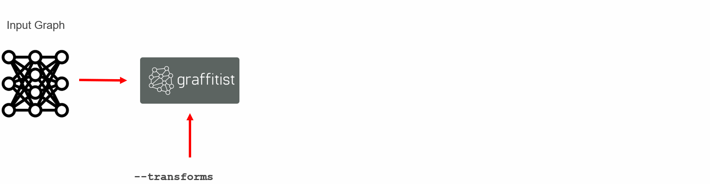

<table style="width:100%">
<tr>
<th width="100%">

<h2>Graph Transforms to Quantize and Retrain Deep Neural Nets in TensorFlow</h2>
</th>
</tr>
</table>

Graffitist is a flexible and scalable framework built on top of TensorFlow to process low-level graph descriptions of deep neural networks (DNNs) for accurate and efficient inference on fixed-point hardware. It comprises of a (growing) library of transforms to apply various neural network compression techniques such as quantization, pruning, and compression. Each transform consists of unique pattern matching and manipulation algorithms that when run sequentially produce an optimized output graph.



Graffitist uses a novel technique for training quantization thresholds (TQT) using standard backpropagation and gradient descent, which results in highly accurate and efficient 8-bit and 4-bit quantized networks amenable to most generic fixed-point hardware. For details, please refer to our paper:

**[Trained Quantization Thresholds for Accurate and Efficient Fixed-Point Inference of Deep Neural Networks](https://arxiv.org/abs/1903.08066)**,
<br>
[Sambhav R. Jain](mailto:sambhav@alumni.stanford.edu),
[Albert Gural](mailto:agural@alumni.stanford.edu),
[Michael Wu](mailto:miwu@xilinx.com),
[Chris H. Dick](mailto:chrisd@xilinx.com),
<br>
*arXiv preprint* arXiv:1903.08066, 2019.

Graffitist stands on the shoulders of giants, and the interface is inspired in part by [earlier](https://github.com/tensorflow/tensorflow/blob/r1.12/tensorflow/tools/graph_transforms/README.md) [tools](https://github.com/tensorflow/tensorflow/blob/r1.12/tensorflow/contrib/quantize/README.md) from TensorFlow. It is developed with tight integration to the static data-flow graph semantics of TensorFlow. This comes with many benefits of a mature ML framework, such as strong low-level graph processing API, accelerated kernels for bit-accurate emulation, extensive pretrained model-zoo, large-scale distributed training, production readiness, clean documentation and great support from TensorFlow developers and the open-source community.

## Contents

* [Quantization](#quantization)
   * [Quantization Scheme](#quantization-scheme)
      * [Supported ops](#supported-ops)
      * [Supported layer topologies](#supported-layer-topologies)
      * [Supported optimizations](#supported-optimizations)
      * [Supported precisions](#supported-precisions)
   * [Imagenet performance](#imagenet-performance)
      * [Changelog](#changelog)
      * [Reproducibility](#reproducibility)
   * [Citations](#citations)
* [Python API](#python-api)
* [Requirements](#requirements)
   * [Kernels](#kernels)
   * [Installation](#installation)
      * [Install Anaconda3](#install-anaconda3)
      * [Install TensorFlow 1.14](#install-tensorflow-114)
      * [<em>(Optional)</em> Install CUDA 10.0, cuDNN 7](#optional-install-cuda-100-cudnn-7)
      * [Install Graffitist](#install-graffitist)
* [How to run](#how-to-run)
   * [Prepare models](#prepare-models)
   * [Set paths](#set-paths)
   * [Configure options](#configure-options)
   * [Pick a recipe and run](#pick-a-recipe-and-run)
      * [Recipe 1: Optimized inference graph](#recipe-1-optimized-inference-graph)
      * [Recipe 2: Quantized inference graph (static mode)](#recipe-2-quantized-inference-graph-static-mode)
      * [Recipe 3: Quantized training graph (retrain mode)](#recipe-3-quantized-training-graph-retrain-mode)
* [Common errors](#common-errors)
* [Default model config](#default-model-config)

---

## Quantization

Graffitist allows for quantization in two modes:

1. **Static Mode.** Quantization thresholds (hence scale factors) are determined based on statistics of activations derived from a *calibration dataset*^. This results in quantized performance (INT8) that is usually competitive with floating-point baselines (FP32) without retraining. Note that while calibration can run on CPU within tens of minutes, use of GPU is recommended due to its ~O(n^2) runtime complexity.

1. **Retrain Mode.** Quantization thresholds and weights are simultaneously trained (TQT method) for improved accuracy and further reduced precision (e.g. INT4). This approach yields highly accurate and compact DNN implementations on a fixed-point target. In many cases, INT8 retrained networks match FP32 accuracy while INT4 retrained networks reach within 1-3% of it depending on network topology. Recovery is achieved within 5 epochs of TQT.

*^small randomly chosen subset of the validation set with appropriate pre-processing applied*

### Quantization scheme

For simplicity and ease of mapping on generic fixed-point hardware, the quantization scheme is constrained to use linear (affine symmetric) mapping with:
- no zero-points
- strict powers-of-2 scale-factors
- per-tensor quantization (for both weights and activations)
- mid-tread quantization

#### Supported ops

- compute: `Conv2D`, `MatMul`, `DepthwiseConv2dNative`
- normalization: `FusedBatchNorm`
- activation: `Relu`, `Relu6`, `LeakyRelu`, `Maximum` (for leaky-relu)
- scale preserving: `ConcatV2`, `BiasAdd`, `Add` (eltwise-add), `Maximum` (for leaky-relu)
- pool: `MaxPool`, `AvgPool`
- classifier: `Softmax`

#### Supported layer topologies

- compute -> normalization/bias-add
- compute -> normalization/bias-add -> activation
- compute -> normalization/bias-add -> eltwise-add
- compute -> normalization/bias-add -> eltwise-add -> activation (relu/relu6)

#### Supported optimizations

- normalization layers following compute layers are folded in
- concat-of-concat layers are collapsed
- identity nodes without control edges are spliced
- avgpool is transformed to depthwise conv with reciprocal multiplier as weights
- input scale sharing is enforced for concat, bias-add, eltwise-add and max ops
- relu/relu6 outputs are quantized to uint8 instead of int8

#### Supported precisions

- compute layers are quantized as q<sub>8</sub>( q<sub>16</sub>( *sum*( q<sub>8/4</sub>(**w**)\*q<sub>8</sub>(**x**) ) ) + q<sub>16</sub>(**b**) )
- leaky-relu is quantized as q<sub>8</sub>( *max*( q<sub>16</sub>(**x**), q<sub>16</sub>( q<sub>16</sub>(**a**)\*q<sub>16</sub>(**x**) ) ) )
- eltwise-add is quantized as q<sub>8</sub>( q<sub>8</sub>(**x**) + q<sub>8</sub>(**y**) )
- avgpool is quantized as q<sub>8</sub>( *sum*( q<sub>8</sub>(**r**)\*q<sub>8</sub>(**x**) ) )

Graffitist is in experimental stages as we continue to add support for more operation types, layer topologies, network styles, graph optimizations, and compression techniques. To request support for options not mentioned above, please submit an [issue](https://github.com/Xilinx/graffitist/issues/new) with details.

### Imagenet performance

|  Static Mode   |      FP32     | INT8 (static) |
|----------------|:-------------:|:-------------:|
|                | top-1 / top-5 | top-1 / top-5 |
| vgg16          |  70.9 / 89.8  |  70.4 / 89.7  |
| vgg19          |  71.0 / 89.8  |  70.4 / 89.7  |
| resnet_v1_50   |  75.2 / 92.2  |  74.3 / 91.7  |
| resnet_v1_101  |  76.4 / 92.9  |  74.8 / 92.0  |
| resnet_v1_152  |  76.8 / 93.2  |  76.2 / 93.0  |
| inception_v1   |  69.8 / 89.6  |  68.6 / 88.9  |
| inception_v2   |  74.0 / 91.8  |  73.1 / 91.3  |
| inception_v3   |  78.0 / 93.9  |  76.8 / 93.3  |
| inception_v4   |  80.2 / 95.2  |  79.4 / 94.6  |
| mobilenet_v1   |  71.0 / 90.0  |   0.6 / 3.6   |
| mobilenet_v2   |  70.1 / 89.5  |   0.3 / 1.2   |
| darknet19      |  73.0 / 91.4  |  68.7 / 89.7  |

|  Retrain Mode  |  FP32 (retrain wt)  |  INT8 (retrain wt)  | INT8 (retrain wt,th)|INT4^ (retrain wt,th)|
|----------------|:-------------------:|:-------------------:|:-------------------:|:-------------------:|
|                | top-1 / top-5 [#ep] | top-1 / top-5 [#ep] | top-1 / top-5 [#ep] | top-1 / top-5 [#ep] |
| vgg16          |  71.9 / 90.5 [1.0]  |  71.8 / 90.5 [1.0]  |  71.7 / 90.4 [0.9]  |  71.5 / 90.3 [4.0]  |
| vgg19          |  71.8 / 90.4 [1.0]  |  71.7 / 90.4 [1.0]  |  71.7 / 90.4 [1.0]  |  71.2 / 90.1 [2.0]  |
| resnet_v1_50   |  75.4 / 92.5 [3.7]  |  75.3 / 92.3 [1.0]  |  75.4 / 92.3 [1.9]  |  74.4 / 91.7 [2.0]  |
| resnet_v1_101  |  76.6 / 93.2 [1.2]  |  76.3 / 93.0 [1.0]  |  76.4 / 93.1 [0.9]  |  75.7 / 92.5 [2.0]  |
| resnet_v1_152  |  76.8 / 93.3 [1.0]  |  76.7 / 93.3 [1.5]  |  76.7 / 93.3 [1.4]  |  76.0 / 93.0 [1.9]  |
| inception_v1   |  70.3 / 90.0 [2.8]  |  70.6 / 90.3 [3.5]  |  70.7 / 90.2 [2.4]  |  67.2 / 88.2 [4.0]  |
| inception_v2   |  74.3 / 92.2 [3.3]  |  74.4 / 92.3 [4.7]  |  74.4 / 92.4 [2.5]  |  71.9 / 90.8 [4.8]  |
| inception_v3   |  78.3 / 94.2 [2.1]  |  78.2 / 94.1 [2.0]  |  78.3 / 94.3 [1.2]  |  76.4 / 93.1 [4.4]  |
| inception_v4   |  80.2 / 95.2 [n/a]  |  80.1 / 95.3 [1.7]  |  80.1 / 95.2 [1.5]  |  78.9 / 94.7 [4.2]  |
| mobilenet_v1   |  71.1 / 90.0 [3.4]  |  67.0 / 87.9 [4.6]  |  71.1 / 90.0 [2.1]  |      n/a            |
| mobilenet_v2   |  71.7 / 90.7 [3.2]  |  68.2 / 89.0 [2.7]  |  71.8 / 90.6 [2.2]  |      n/a            |
| darknet19      |  74.4 / 92.3 [3.1]  |  72.9 / 91.6 [3.8]  |  74.5 / 92.3 [1.8]  |  73.2 / 91.6 [2.8]  |

^INT4 weights, INT8 activations. First/last layer weights are kept as INT8.

#### Changelog

The following modifications were done before exporting the graph definitions to serialized TensorFlow protocol buffers:
1. Replaced `reduce_mean` with `avg_pool`
1. Removed `dropout`
1. Removed auxiliary logits layers

#### Reproducibility

The top-1/top-5 accuracy metrics are evaluated on Imagenet validation set (50k images) downloaded from [here](http://www.image-net.org/download-images) and processed into TFRecord format using [this script](https://github.com/tensorflow/models/blob/r1.12.0/research/slim/datasets/build_imagenet_data.py). We expect to see some degree of randomness (+-0.1%) between runs on:

- different platforms
  - when dataset is processed using different image library versions
  - due to non-deterministic thread scheduling
  - due to driver version differences
- same platform
  - when more than one valid topological orders are feasible
  - due to inexact floating point math

### Citations

Please consider citing our work if you find it useful for your research.

#### Paper

```
@article{tqt2019,
  title={Trained Quantization Thresholds for Accurate and Efficient Fixed-Point Inference of Deep Neural Networks},
  author={Jain, Sambhav R and Gural, Albert and Wu, Michael and Dick, Chris H},
  journal={arXiv preprint arXiv:1903.08066},
  year={2019}
}
```

#### Framework

```
@misc{graffitist2019,
  author = {Xilinx},
  title = {Graffitist: Graph Transforms to Quantize and Retrain Deep Neural Nets in TensorFlow},
  year = {2019},
  publisher = {GitHub},
  journal = {GitHub repository},
  howpublished = {\url{https://github.com/Xilinx/graffitist}}
}
```

[[back to ToC]](#contents)

---

## Python API

Graffitist uses a Python interface and is invoked as follows:

```
python graffitist/graffitize.pyc \
          --in_graph        <path_to_in_graph.pb> \
          --out_graph       <path_to_out_graph.pb> \
          --inputs          <input_node_name> \
          --outputs         <output_node_name> \
          --input_shape     <H,W,C> \
          --transforms      <list_of_transforms_to_apply>
```

For a full list of arguments and available transforms, use the help option: `python graffitist/graffitize.pyc -h`.

We also provide utility scripts for end-to-end training and validation of Graffitist quantized networks on ImageNet.

#### Training

```
python scripts/train_imagenet_tf.py \
          --data_dir        <path_to_tfrecords_dir> \
          --ckpt_dir        <path_to_ckpt_meta_dir> \
          --image_size      <size> \
          --batch_size_t    <N>
```

#### Validation

```
python scripts/validate_imagenet_tf.py \
          --data_dir        <path_to_tfrecords_dir> \
          --model_dir       <path_to_model_dir> \
          --image_size      <size> \
          --batch_size      <N>
```

#### Calibration set generation

```
python scripts/validate_imagenet_tf.py \
          --data_dir        <path_to_tfrecords_dir> \
          --model_dir       <path_to_model_dir> \
          --image_size      <size> \
          --calib_set_size  <N> \
          --gen_calib_set
```

[[back to ToC]](#contents)

---

## Requirements

Graffitist is packaged with custom quantization kernels (C++/CUDA) that are pre-compiled on the following configuration:
- Ubuntu 16.04
- Python 3.6
- TensorFlow 1.14 (CPU or GPU)
- CUDA 10.0, cuDNN 7 (if GPU)

### Kernels

To load the pre-compiled kernels, prepend the following code (update paths as necessary) to your Python scripts. For example, see the provided [validation script](#validation).
```python
import tensorflow as tf

cpu_kernel_path = './kernels/quantize_ops.so'
gpu_kernel_path = './kernels/quantize_ops_cuda.so'

if tf.test.is_built_with_cuda() and tf.test.is_gpu_available(cuda_only=True):
  tf.load_op_library(gpu_kernel_path)
else:
  tf.load_op_library(cpu_kernel_path)
```

### Installation

#### Install Anaconda3

Download and install Anaconda3.
```
wget https://repo.anaconda.com/archive/Anaconda3-2019.03-Linux-x86_64.sh
bash ./Anaconda3-2019.03-Linux-x86_64.sh
```

When prompted, allow the installer to initialize Anaconda3 and setup your `.bashrc`. Then close and open a new bash shell to source the installation correctly.

Create a new conda environment `tf1.14` with Python 3.6 interpreter and activate it.
```
conda create -n tf1.14 pip python=3.6
conda activate tf1.14
```

#### Install TensorFlow 1.14

CPU-only:
```
pip install --ignore-installed --upgrade https://storage.googleapis.com/tensorflow/linux/cpu/tensorflow-1.14.0-cp36-cp36m-linux_x86_64.whl
```

GPU:
```
pip install --ignore-installed --upgrade https://storage.googleapis.com/tensorflow/linux/gpu/tensorflow_gpu-1.14.0-cp36-cp36m-linux_x86_64.whl
```

#### *(Optional)* Install CUDA 10.0, cuDNN 7

The following NVIDIA® software is required to use TensorFlow with GPU support:

- [NVIDIA® GPU drivers](https://www.nvidia.com/drivers) CUDA 10.0 requires 410.x or higher.
- [CUDA® Toolkit](https://developer.nvidia.com/cuda-zone) TensorFlow supports CUDA 10.0 (TensorFlow >= 1.13.0).
- [CUPTI](http://docs.nvidia.com/cuda/cupti/) ships with the CUDA Toolkit.
- [cuDNN SDK](https://developer.nvidia.com/cudnn) (>= 7.4.1)

#### Install Graffitist

Clone Graffitist and install locally.
```
git clone https://github.com/Xilinx/graffitist.git
pip install -e graffitist
cd ./graffitist
```

[[back to ToC]](#contents)

---

## How to run

### Prepare models

To get started, we provide a set of standard networks including graph descriptions (`.pb`/`.meta`), pre-trained FP32 weights (`.ckpt`) and calibration datasets (`.npy`) with applied preprocessing. Both eval and training graphs are included (for static and retrain mode respectively). This is because training specific layers (`batch_normalization`, `dropout`, etc) behave differently in the two modes.

|    Network     | Download    |
|----------------|:-----------:|
| vgg16          | [static](https://www.xilinx.com/bin/public/openDownload?filename=models.vgg16_slim_pretrained_2019-01-09.zip) / [retrain](https://www.xilinx.com/bin/public/openDownload?filename=models.vgg16_slim_pretrained_train_2019-01-09.zip)
| vgg19          | [static](https://www.xilinx.com/bin/public/openDownload?filename=models.vgg19_slim_pretrained_2019-01-09.zip) / [retrain](https://www.xilinx.com/bin/public/openDownload?filename=models.vgg19_slim_pretrained_train_2019-01-09.zip)
| resnet_v1_50   | [static](https://www.xilinx.com/bin/public/openDownload?filename=models.resnet_v1_50_slim_pretrained_2019-01-09.zip) / [retrain](https://www.xilinx.com/bin/public/openDownload?filename=models.resnet_v1_50_slim_pretrained_train_2019-01-09.zip)
| resnet_v1_101  | [static](https://www.xilinx.com/bin/public/openDownload?filename=models.resnet_v1_101_slim_pretrained_2019-01-09.zip) / [retrain](https://www.xilinx.com/bin/public/openDownload?filename=models.resnet_v1_101_slim_pretrained_train_2019-01-09.zip)
| resnet_v1_152  | [static](https://www.xilinx.com/bin/public/openDownload?filename=models.resnet_v1_152_slim_pretrained_2019-01-09.zip) / [retrain](https://www.xilinx.com/bin/public/openDownload?filename=models.resnet_v1_152_slim_pretrained_train_2019-01-09.zip)
| inception_v1   | [static](https://www.xilinx.com/bin/public/openDownload?filename=models.inception_v1_bn_slim_pretrained_2019-01-09.zip) / [retrain](https://www.xilinx.com/bin/public/openDownload?filename=models.inception_v1_bn_slim_pretrained_train_2019-01-09.zip)
| inception_v2   | [static](https://www.xilinx.com/bin/public/openDownload?filename=models.inception_v2_slim_pretrained_2019-01-09.zip) / [retrain](https://www.xilinx.com/bin/public/openDownload?filename=models.inception_v2_slim_pretrained_train_2019-01-09.zip)
| inception_v3   | [static](https://www.xilinx.com/bin/public/openDownload?filename=models.inception_v3_slim_pretrained_2019-01-09.zip) / [retrain](https://www.xilinx.com/bin/public/openDownload?filename=models.inception_v3_slim_pretrained_train_2019-01-09.zip)
| inception_v4   | [static](https://www.xilinx.com/bin/public/openDownload?filename=models.inception_v4_slim_pretrained_2019-01-09.zip) / [retrain](https://www.xilinx.com/bin/public/openDownload?filename=models.inception_v4_slim_pretrained_train_2019-01-09.zip)
| mobilenet_v1   | [static](https://www.xilinx.com/bin/public/openDownload?filename=models.mobilenet_v1_slim_pretrained_2019-01-09.zip) / [retrain](https://www.xilinx.com/bin/public/openDownload?filename=models.mobilenet_v1_slim_pretrained_train_2019-01-09.zip)
| mobilenet_v2   | [static](https://www.xilinx.com/bin/public/openDownload?filename=models.mobilenet_v2_slim_pretrained_2019-01-09.zip) / [retrain](https://www.xilinx.com/bin/public/openDownload?filename=models.mobilenet_v2_slim_pretrained_train_2019-01-09.zip)
| darknet19      | [static](https://www.xilinx.com/bin/public/openDownload?filename=models.darknet19_dw2tf_pretrained_0313_0943.zip) / [retrain](https://www.xilinx.com/bin/public/openDownload?filename=models.darknet19_dw2tf_pretrained_train_0313_0943.zip)
| yolo_v2        | [static](https://www.xilinx.com/bin/public/openDownload?filename=models.yolo_v2_dw2tf_pretrained_2019-07-30.zip)
| yolo_v2_tiny   | [static](https://www.xilinx.com/bin/public/openDownload?filename=models.yolo_v2_tiny_dw2tf_pretrained_2019-07-30.zip)

If using one of the provided models, simply download and extract to `./models/` dir and proceed to [next step](#set-paths).

If bringing your own model (BYOM), ensure the following files are saved out to `./models/my_model_dir/`:
```
my_model.pb
checkpoint
my_model.ckpt.data-00000-of-00001
my_model.ckpt.index
my_model.ckpt.meta (only needed in retrain mode)
calibration_set.npy
```

The graph `.pb` is a serialized TensorFlow protocol buffer containing the nodes and edges. Refer [here](https://www.tensorflow.org/guide/extend/model_files) for details on TensorFlow protocol buffers. Note that the input graph to Graffitist can contain frozen weights if static mode quantization is desired. For retrain mode, weights should NOT be frozen into the graph definition.

The `checkpoint` file points to the specific `.ckpt` to use.  For example:
```
model_checkpoint_path: "my_model.ckpt"
all_model_checkpoint_paths: "my_model.ckpt"
```
Refer [here](https://www.tensorflow.org/guide/saved_model#save_variables) for details on saving TensorFlow checkpoints.

The metagraph `.meta` contains the graph and training metadata (e.g. variable collections, weight regularization). It is only required in retrain mode. Refer [here](https://www.tensorflow.org/api_guides/python/meta_graph) for details on exporting TensorFlow metagraph.

The calibration set `.npy` contains N randomly sampled images with applied data pre-processing, stored as a numpy array of shape `[N, H, W, C]`. See the included [validation script](#calibration-set-generation) for more details on generating a calibration set.

UPDATE: [SavedModel](https://www.tensorflow.org/guide/saved_model) interface is on the way!

### Set paths

Activate conda env and set paths:
```
conda activate tf1.14

groot=`find -name 'graffitize.pyc' -printf '%h\n'`
mroot=`find -name 'models'`
```

To retrain for INT4, set `INT4_MODE` as follows (ignored in static mode):
```
INT4_MODE="1"
```

### Configure options

Choose a network and configure for either static or retrain mode:

| Network        | Config    |
|----------------|:---------:|
| vgg16          | [static](#vgg16-static) / [retrain](#vgg16-retrain)
| vgg19          | [static](#vgg19-static) / [retrain](#vgg19-retrain)
| resnet_v1_50   | [static](#resnet_v1_50-static) / [retrain](#resnet_v1_50-retrain)
| resnet_v1_101  | [static](#resnet_v1_101-static) / [retrain](#resnet_v1_101-retrain)
| resnet_v1_152  | [static](#resnet_v1_152-static) / [retrain](#resnet_v1_152-retrain)
| inception_v1   | [static](#inception_v1-static) / [retrain](#inception_v1-retrain)
| inception_v2   | [static](#inception_v2-static) / [retrain](#inception_v2-retrain)
| inception_v3   | [static](#inception_v3-static) / [retrain](#inception_v3-retrain)
| inception_v4   | [static](#inception_v4-static) / [retrain](#inception_v4-retrain)
| mobilenet_v1   | [static](#mobilenet_v1-static) / [retrain](#mobilenet_v1-retrain)
| mobilenet_v2   | [static](#mobilenet_v2-static) / [retrain](#mobilenet_v2-retrain)
| darknet19      | [static](#darknet19-static) / [retrain](#darknet19-retrain)
| yolo_v2        | [static](#yolo_v2-static)
| yolo_v2_tiny   | [static](#yolo_v2_tiny-static)

For a full list of default config options see [examples](#default-model-config).

If BYOM, set config options based on your model (similar to the examples provided).

### Pick a recipe and run

#### Recipe 1: Optimized inference graph

This recipe applies various layer optimizations and pre-processing to generate a simplified inference graph (not quantized yet).
```
python $groot/graffitize.pyc \
    --in_graph $in_graph \
    --out_graph $opt_graph \
    --inputs $input_node \
    --outputs $output_node \
    --input_shape $input_shape \
    --transforms 'fix_input_shape' \
                 'fold_batch_norms' \
                 'remove_training_nodes' \
                 'strip_unused_nodes' \
                 'preprocess_layers'
```

#### Recipe 2: Quantized inference graph (static mode)

This recipe quantizes the inference graph using static calibration for efficient fixed-point implementation.
```
python $groot/graffitize.pyc \
    --in_graph $in_graph \
    --out_graph $quant_graph \
    --inputs $input_node \
    --outputs $output_node \
    --input_shape $input_shape \
    --transforms 'fix_input_shape' \
                 'fold_batch_norms' \
                 'remove_training_nodes' \
                 'strip_unused_nodes' \
                 'preprocess_layers' \
                 'quantize(weight_bits='$wb', activation_bits='$ab', layer_bits='$lb', relu_bits='$rb', avgpool_bits='$pb', avgpool_reciprocal_bits='$prb')'
```

#### Recipe 3: Quantized training graph (retrain mode)

Follow these steps to retrain quantized networks:

*Step 1:* Generate the quantized training graph.
```
python $groot/graffitize.pyc \
    --in_graph $in_metagraph \
    --out_graph $trainquant_graph \
    --inputs $input_node \
    --outputs $output_node \
    --input_shape $input_shape \
    --transforms 'fix_input_shape' \
                 'fold_batch_norms(is_training=True)' \
                 'preprocess_layers' \
                 'quantize(is_training=True, weight_bits='$wb', activation_bits='$ab', layer_bits='$lb', relu_bits='$rb', avgpool_bits='$pb', avgpool_reciprocal_bits='$prb', first_layer='$first_layer', last_layer='$last_layer')'
```

*Step 2:* Retrain. For the example networks, use the included [training script](#training). Once converged, ensure `checkpoint` points to the correct retrained ckpt.

*Step 3:* Generate the equivalent quantized inference graph using retrained variables from previous step.
```
python $groot/graffitize.pyc \
    --in_graph $in_graph \
    --out_graph $infquant_graph \
    --inputs $input_node \
    --outputs $output_node \
    --input_shape $input_shape \
    --transforms 'fix_input_shape' \
                 'fold_batch_norms' \
                 'remove_training_nodes' \
                 'strip_unused_nodes' \
                 'preprocess_layers' \
                 'quantize(calibrate_quant_layers=False, weight_bits='$wb', activation_bits='$ab', layer_bits='$lb', relu_bits='$rb', avgpool_bits='$pb', avgpool_reciprocal_bits='$prb', first_layer='$first_layer', last_layer='$last_layer')'
```

[[back to ToC]](#contents)

---

## Common errors

| Error Message | Possible Fix
|:--------------|:---------------
| `RuntimeError: Bad magic number in .pyc file` | Use correct Python version; see [Requirements](#requirements)
| `tensorflow.python.framework.errors_impl.NotFoundError: graffitist/kernels/quantize_ops.so: undefined symbol: _ZN10tensorflow22CheckNotInComputeAsyncEPNS_15OpKernelContextEPKc` | Use correct TensorFlow version; see [Requirements](#requirements)
| `tensorflow.python.framework.errors_impl.NotFoundError: graffitist/kernels/quantize_ops_cuda.so: undefined symbol: _ZN10tensorflow22CheckNotInComputeAsyncEPNS_15OpKernelContextEPKc` | Use correct TensorFlow version; see [Requirements](#requirements)
| `ImportError: libcublas.so.10.0: cannot open shared object file: No such file or directory` | Use correct CUDA version with TF for GPU; see [Requirements](#requirements)
| `RecursionError: maximum recursion depth exceeded in comparison` | Stack limit set to 3k (default: 1k) to avoid stack overflows for lack of tail-call optimization in Python; [get in touch](https://github.com/Xilinx/graffitist/issues/new)

[[back to ToC]](#contents)

---

## Default model config

#### vgg16 (static)

```
mdir=$mroot/vgg16_slim_pretrained
in_graph=$mdir/vgg16_slim_pretrained.pb
opt_graph=$mdir/vgg16_slim_pretrained_opt.pb
quant_graph=$mdir/vgg16_slim_pretrained_quant.pb
input_node=input
output_node=vgg_16/fc8/squeezed
input_shape=224,224,3
wb=-8; ab=-8; lb=-16; rb=8; pb=8; prb=8;
```
[[continue]](#pick-a-recipe-and-run)

#### vgg16 (retrain)

```
mdir=$mroot/vgg16_slim_pretrained_train
in_metagraph=$mdir/vgg16_slim_pretrained.ckpt.meta
in_graph=$mdir/vgg16_slim_pretrained.pb
opt_graph=$mdir/vgg16_slim_pretrained_opt.pb
trainquant_graph=$mdir/vgg16_slim_pretrained_trainquant.pb
infquant_graph=$mdir/vgg16_slim_pretrained_infquant.pb
input_node=input
output_node=vgg_16/fc8/squeezed
input_shape=224,224,3
[ "$INT4_MODE" = 1 ] && wb=-4 || wb=-8; ab=-8; lb=-16; rb=8; pb=8; prb=8;
first_layer=vgg_16/conv1/conv1_1/Conv2D
last_layer=vgg_16/fc8/Conv2D
```
[[continue]](#pick-a-recipe-and-run)

#### vgg19 (static)

```
mdir=$mroot/vgg19_slim_pretrained
in_graph=$mdir/vgg19_slim_pretrained.pb
opt_graph=$mdir/vgg19_slim_pretrained_opt.pb
quant_graph=$mdir/vgg19_slim_pretrained_quant.pb
input_node=input
output_node=vgg_19/fc8/squeezed
input_shape=224,224,3
wb=-8; ab=-8; lb=-16; rb=8; pb=8; prb=8;
```
[[continue]](#pick-a-recipe-and-run)

#### vgg19 (retrain)

```
mdir=$mroot/vgg19_slim_pretrained_train
in_metagraph=$mdir/vgg19_slim_pretrained.ckpt.meta
in_graph=$mdir/vgg19_slim_pretrained.pb
opt_graph=$mdir/vgg19_slim_pretrained_opt.pb
trainquant_graph=$mdir/vgg19_slim_pretrained_trainquant.pb
infquant_graph=$mdir/vgg19_slim_pretrained_infquant.pb
input_node=input
output_node=vgg_19/fc8/squeezed
input_shape=224,224,3
[ "$INT4_MODE" = 1 ] && wb=-4 || wb=-8; ab=-8; lb=-16; rb=8; pb=8; prb=8;
first_layer=vgg_19/conv1/conv1_1/Conv2D
last_layer=vgg_19/fc8/Conv2D
```
[[continue]](#pick-a-recipe-and-run)

#### resnet_v1_50 (static)

```
mdir=$mroot/resnet_v1_50_slim_pretrained
in_graph=$mdir/resnet_v1_50_slim_pretrained.pb
opt_graph=$mdir/resnet_v1_50_slim_pretrained_opt.pb
quant_graph=$mdir/resnet_v1_50_slim_pretrained_quant.pb
input_node=input
output_node=resnet_v1_50/predictions/Softmax
input_shape=224,224,3
wb=-8; ab=-8; lb=-16; rb=8; pb=8; prb=8;
```
[[continue]](#pick-a-recipe-and-run)

#### resnet_v1_50 (retrain)

```
mdir=$mroot/resnet_v1_50_slim_pretrained_train
in_metagraph=$mdir/resnet_v1_50_slim_pretrained.ckpt.meta
in_graph=$mdir/resnet_v1_50_slim_pretrained.pb
opt_graph=$mdir/resnet_v1_50_slim_pretrained_opt.pb
trainquant_graph=$mdir/resnet_v1_50_slim_pretrained_trainquant.pb
infquant_graph=$mdir/resnet_v1_50_slim_pretrained_infquant.pb
input_node=input
output_node=resnet_v1_50/predictions/Softmax
input_shape=224,224,3
[ "$INT4_MODE" = 1 ] && wb=-4 || wb=-8; ab=-8; lb=-16; rb=8; pb=8; prb=8;
first_layer=resnet_v1_50/conv1/Conv2D
last_layer=resnet_v1_50/logits/Conv2D
```
[[continue]](#pick-a-recipe-and-run)

#### resnet_v1_101 (static)

```
mdir=$mroot/resnet_v1_101_slim_pretrained
in_graph=$mdir/resnet_v1_101_slim_pretrained.pb
opt_graph=$mdir/resnet_v1_101_slim_pretrained_opt.pb
quant_graph=$mdir/resnet_v1_101_slim_pretrained_quant.pb
input_node=input
output_node=resnet_v1_101/predictions/Softmax
input_shape=224,224,3
wb=-8; ab=-8; lb=-16; rb=8; pb=8; prb=8;
```
[[continue]](#pick-a-recipe-and-run)

#### resnet_v1_101 (retrain)

```
mdir=$mroot/resnet_v1_101_slim_pretrained_train
in_metagraph=$mdir/resnet_v1_101_slim_pretrained.ckpt.meta
in_graph=$mdir/resnet_v1_101_slim_pretrained.pb
opt_graph=$mdir/resnet_v1_101_slim_pretrained_opt.pb
trainquant_graph=$mdir/resnet_v1_101_slim_pretrained_trainquant.pb
infquant_graph=$mdir/resnet_v1_101_slim_pretrained_infquant.pb
input_node=input
output_node=resnet_v1_101/predictions/Softmax
input_shape=224,224,3
[ "$INT4_MODE" = 1 ] && wb=-4 || wb=-8; ab=-8; lb=-16; rb=8; pb=8; prb=8;
first_layer=resnet_v1_101/conv1/Conv2D
last_layer=resnet_v1_101/logits/Conv2D
```
[[continue]](#pick-a-recipe-and-run)

#### resnet_v1_152 (static)

```
mdir=$mroot/resnet_v1_152_slim_pretrained
in_graph=$mdir/resnet_v1_152_slim_pretrained.pb
opt_graph=$mdir/resnet_v1_152_slim_pretrained_opt.pb
quant_graph=$mdir/resnet_v1_152_slim_pretrained_quant.pb
input_node=input
output_node=resnet_v1_152/predictions/Softmax
input_shape=224,224,3
wb=-8; ab=-8; lb=-16; rb=8; pb=8; prb=8;
```
[[continue]](#pick-a-recipe-and-run)

#### resnet_v1_152 (retrain)

```
mdir=$mroot/resnet_v1_152_slim_pretrained_train
in_metagraph=$mdir/resnet_v1_152_slim_pretrained.ckpt.meta
in_graph=$mdir/resnet_v1_152_slim_pretrained.pb
opt_graph=$mdir/resnet_v1_152_slim_pretrained_opt.pb
trainquant_graph=$mdir/resnet_v1_152_slim_pretrained_trainquant.pb
infquant_graph=$mdir/resnet_v1_152_slim_pretrained_infquant.pb
input_node=input
output_node=resnet_v1_152/predictions/Softmax
input_shape=224,224,3
[ "$INT4_MODE" = 1 ] && wb=-4 || wb=-8; ab=-8; lb=-16; rb=8; pb=8; prb=8;
first_layer=resnet_v1_152/conv1/Conv2D
last_layer=resnet_v1_152/logits/Conv2D
```
[[continue]](#pick-a-recipe-and-run)

#### inception_v1 (static)

```
mdir=$mroot/inception_v1_bn_slim_pretrained
in_graph=$mdir/inception_v1_bn_slim_pretrained.pb
opt_graph=$mdir/inception_v1_bn_slim_pretrained_opt.pb
quant_graph=$mdir/inception_v1_bn_slim_pretrained_quant.pb
input_node=input
output_node=InceptionV1/Logits/Predictions/Softmax
input_shape=224,224,3
wb=-8; ab=-8; lb=-16; rb=8; pb=8; prb=8;
```
[[continue]](#pick-a-recipe-and-run)

#### inception_v1 (retrain)

```
mdir=$mroot/inception_v1_bn_slim_pretrained_train
in_metagraph=$mdir/inception_v1_bn_slim_pretrained.ckpt.meta
in_graph=$mdir/inception_v1_bn_slim_pretrained.pb
opt_graph=$mdir/inception_v1_bn_slim_pretrained_opt.pb
trainquant_graph=$mdir/inception_v1_bn_slim_pretrained_trainquant.pb
infquant_graph=$mdir/inception_v1_bn_slim_pretrained_infquant.pb
input_node=input
output_node=InceptionV1/Logits/Predictions/Softmax
input_shape=224,224,3
[ "$INT4_MODE" = 1 ] && wb=-4 || wb=-8; ab=-8; lb=-16; rb=8; pb=8; prb=8;
first_layer=InceptionV1/InceptionV1/Conv2d_1a_7x7/Conv2D
last_layer=InceptionV1/Logits/Conv2d_0c_1x1/Conv2D
```
[[continue]](#pick-a-recipe-and-run)

#### inception_v2 (static)

```
mdir=$mroot/inception_v2_slim_pretrained
in_graph=$mdir/inception_v2_slim_pretrained.pb
opt_graph=$mdir/inception_v2_slim_pretrained_opt.pb
quant_graph=$mdir/inception_v2_slim_pretrained_quant.pb
input_node=input
output_node=InceptionV2/Predictions/Softmax
input_shape=224,224,3
wb=-8; ab=-8; lb=-16; rb=8; pb=8; prb=8;
```
[[continue]](#pick-a-recipe-and-run)

#### inception_v2 (retrain)

```
mdir=$mroot/inception_v2_slim_pretrained_train
in_metagraph=$mdir/inception_v2_slim_pretrained.ckpt.meta
in_graph=$mdir/inception_v2_slim_pretrained.pb
opt_graph=$mdir/inception_v2_slim_pretrained_opt.pb
trainquant_graph=$mdir/inception_v2_slim_pretrained_trainquant.pb
infquant_graph=$mdir/inception_v2_slim_pretrained_infquant.pb
input_node=input
output_node=InceptionV2/Predictions/Softmax
input_shape=224,224,3
[ "$INT4_MODE" = 1 ] && wb=-4 || wb=-8; ab=-8; lb=-16; rb=8; pb=8; prb=8;
first_layer=InceptionV2/InceptionV2/Conv2d_1a_7x7/separable_conv2d/depthwise
last_layer=InceptionV2/Logits/Conv2d_1c_1x1/Conv2D
```
[[continue]](#pick-a-recipe-and-run)

#### inception_v3 (static)

```
mdir=$mroot/inception_v3_slim_pretrained
in_graph=$mdir/inception_v3_slim_pretrained.pb
opt_graph=$mdir/inception_v3_slim_pretrained_opt.pb
quant_graph=$mdir/inception_v3_slim_pretrained_quant.pb
input_node=input
output_node=InceptionV3/Predictions/Softmax
input_shape=299,299,3
wb=-8; ab=-8; lb=-16; rb=8; pb=8; prb=8;
```
[[continue]](#pick-a-recipe-and-run)

#### inception_v3 (retrain)

```
mdir=$mroot/inception_v3_slim_pretrained_train
in_metagraph=$mdir/inception_v3_slim_pretrained.ckpt.meta
in_graph=$mdir/inception_v3_slim_pretrained.pb
opt_graph=$mdir/inception_v3_slim_pretrained_opt.pb
trainquant_graph=$mdir/inception_v3_slim_pretrained_trainquant.pb
infquant_graph=$mdir/inception_v3_slim_pretrained_infquant.pb
input_node=input
output_node=InceptionV3/Predictions/Softmax
input_shape=299,299,3
[ "$INT4_MODE" = 1 ] && wb=-4 || wb=-8; ab=-8; lb=-16; rb=8; pb=8; prb=8;
first_layer=InceptionV3/InceptionV3/Conv2d_1a_3x3/Conv2D
last_layer=InceptionV3/Logits/Conv2d_1c_1x1/Conv2D
```
[[continue]](#pick-a-recipe-and-run)

#### inception_v4 (static)

```
mdir=$mroot/inception_v4_slim_pretrained
in_graph=$mdir/inception_v4_slim_pretrained.pb
opt_graph=$mdir/inception_v4_slim_pretrained_opt.pb
quant_graph=$mdir/inception_v4_slim_pretrained_quant.pb
input_node=input
output_node=InceptionV4/Logits/Predictions
input_shape=299,299,3
wb=-8; ab=-8; lb=-16; rb=8; pb=8; prb=8;
```
[[continue]](#pick-a-recipe-and-run)

#### inception_v4 (retrain)

```
mdir=$mroot/inception_v4_slim_pretrained_train
in_metagraph=$mdir/inception_v4_slim_pretrained.ckpt.meta
in_graph=$mdir/inception_v4_slim_pretrained.pb
opt_graph=$mdir/inception_v4_slim_pretrained_opt.pb
trainquant_graph=$mdir/inception_v4_slim_pretrained_trainquant.pb
infquant_graph=$mdir/inception_v4_slim_pretrained_infquant.pb
input_node=input
output_node=InceptionV4/Logits/Predictions
input_shape=299,299,3
[ "$INT4_MODE" = 1 ] && wb=-4 || wb=-8; ab=-8; lb=-16; rb=8; pb=8; prb=8;
first_layer=InceptionV4/InceptionV4/Conv2d_1a_3x3/Conv2D
last_layer=InceptionV4/Logits/Logits/MatMul
```
[[continue]](#pick-a-recipe-and-run)

#### mobilenet_v1 (static)

```
mdir=$mroot/mobilenet_v1_slim_pretrained
in_graph=$mdir/mobilenet_v1_slim_pretrained.pb
opt_graph=$mdir/mobilenet_v1_slim_pretrained_opt.pb
quant_graph=$mdir/mobilenet_v1_slim_pretrained_quant.pb
input_node=input
output_node=MobilenetV1/Predictions/Softmax
input_shape=224,224,3
wb=-8; ab=-8; lb=-16; rb=8; pb=8; prb=8;
```
[[continue]](#pick-a-recipe-and-run)

#### mobilenet_v1 (retrain)

```
mdir=$mroot/mobilenet_v1_slim_pretrained_train
in_metagraph=$mdir/mobilenet_v1_slim_pretrained.ckpt.meta
in_graph=$mdir/mobilenet_v1_slim_pretrained.pb
opt_graph=$mdir/mobilenet_v1_slim_pretrained_opt.pb
trainquant_graph=$mdir/mobilenet_v1_slim_pretrained_trainquant.pb
infquant_graph=$mdir/mobilenet_v1_slim_pretrained_infquant.pb
input_node=input
output_node=MobilenetV1/Predictions/Softmax
input_shape=224,224,3
[ "$INT4_MODE" = 1 ] && wb=-4 || wb=-8; ab=-8; lb=-16; rb=8; pb=8; prb=8;
first_layer=MobilenetV1/MobilenetV1/Conv2d_0/Conv2D
last_layer=MobilenetV1/Logits/Conv2d_1c_1x1/Conv2D
```
[[continue]](#pick-a-recipe-and-run)

#### mobilenet_v2 (static)

```
mdir=$mroot/mobilenet_v2_slim_pretrained
in_graph=$mdir/mobilenet_v2_slim_pretrained.pb
opt_graph=$mdir/mobilenet_v2_slim_pretrained_opt.pb
quant_graph=$mdir/mobilenet_v2_slim_pretrained_quant.pb
input_node=input
output_node=MobilenetV2/Predictions/Softmax
input_shape=224,224,3
wb=-8; ab=-8; lb=-16; rb=8; pb=8; prb=8;
```
[[continue]](#pick-a-recipe-and-run)

#### mobilenet_v2 (retrain)

```
mdir=$mroot/mobilenet_v2_slim_pretrained_train
in_metagraph=$mdir/mobilenet_v2_slim_pretrained.ckpt.meta
in_graph=$mdir/mobilenet_v2_slim_pretrained.pb
opt_graph=$mdir/mobilenet_v2_slim_pretrained_opt.pb
trainquant_graph=$mdir/mobilenet_v2_slim_pretrained_trainquant.pb
infquant_graph=$mdir/mobilenet_v2_slim_pretrained_infquant.pb
input_node=input
output_node=MobilenetV2/Predictions/Softmax
input_shape=224,224,3
[ "$INT4_MODE" = 1 ] && wb=-4 || wb=-8; ab=-8; lb=-16; rb=8; pb=8; prb=8;
first_layer=MobilenetV2/Conv/Conv2D
last_layer=MobilenetV2/Logits/Conv2d_1c_1x1/Conv2D
```
[[continue]](#pick-a-recipe-and-run)

#### darknet19 (static)

```
mdir=$mroot/darknet19_dw2tf_pretrained
in_graph=$mdir/darknet19.pb
opt_graph=$mdir/darknet19_opt.pb
quant_graph=$mdir/darknet19_quant.pb
input_node=darknet19/net1
output_node=darknet19/softmax1/Softmax
input_shape=256,256,3
wb=-8; ab=-8; lb=-16; rb=8; pb=-8; prb=8;
```
[[continue]](#pick-a-recipe-and-run)

#### darknet19 (retrain)

```
mdir=$mroot/darknet19_dw2tf_pretrained_train
in_metagraph=$mdir/darknet19.ckpt.meta
in_graph=$mdir/darknet19.pb
opt_graph=$mdir/darknet19_opt.pb
trainquant_graph=$mdir/darknet19_trainquant.pb
infquant_graph=$mdir/darknet19_infquant.pb
input_node=darknet19/net1
output_node=darknet19/softmax1/Softmax
input_shape=256,256,3
[ "$INT4_MODE" = 1 ] && wb=-4 || wb=-8; ab=-8; lb=-16; rb=8; pb=-8; prb=8;
first_layer=darknet19/convolutional1/Conv2D
last_layer=darknet19/convolutional19/Conv2D
```
[[continue]](#pick-a-recipe-and-run)

#### yolo_v2 (static)

```
mdir=$mroot/yolo_v2_dw2tf_pretrained
in_graph=$mdir/yolov2.pb
opt_graph=$mdir/yolov2_opt.pb
quant_graph=$mdir/yolov2_quant.pb
input_node=yolov2/net1
output_node=yolov2/convolutional23/BiasAdd
input_shape=608,608,3
wb=-8; ab=-8; lb=-16; rb=8; pb=8; prb=8;
```
[[continue]](#pick-a-recipe-and-run)

#### yolo_v2_tiny (static)

```
mdir=$mroot/yolo_v2_tiny_dw2tf_pretrained
in_graph=$mdir/yolov2-tiny.pb
opt_graph=$mdir/yolov2-tiny_opt.pb
quant_graph=$mdir/yolov2-tiny_quant.pb
input_node=yolov2-tiny/net1
output_node=yolov2-tiny/convolutional9/BiasAdd
input_shape=416,416,3
wb=-8; ab=-8; lb=-16; rb=8; pb=8; prb=8;
```
[[continue]](#pick-a-recipe-and-run)

[[back to ToC]](#contents)

---

